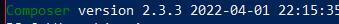

# LaravelAvontuur
A remade of my kilk game in larvael <br>
Loaction 15=Monster encounter<br> 
Location 21=Npc loaction <br> 
Location 22=Item location <br>
Location 27=Shop Location <br>
Location 46=Warehouse

# Used libarys
carbon time class <br> link:http://carbon.nesbot.com/#gettingstarted

# Install guide

## Step 0 
First make sure that the following things are checked and are installed

#### Php version 8.0.2
#### Composer installed -->  https://getcomposer.org/ 
#### NPM --> https://phoenixnap.com/kb/install-node-js-npm-on-windows
#### Current laravel version --> 9.2

## Step 1 Installing How?
To first determine which path to follow i ask you to look at the next statement.

Are you either trying to update your current project?
Or are you downloading it for the first time?

For both cases its required to check Step 0 first.
In case something is missing make sure its installed or updated.

I will go over the steps needed to either to install or update your application.
These are also steps that I encountered while i updated the application from laravel 5 -> 9
In theory you should always by installing this or cloning it through the given repo

## Step 2 Composer 
First we recommend running composer update.
In case a lot of errors, and you can`t run composer update. <br>
Then I ask to check to 2 following things:

### Step 2.1 Composer is runnable? 
I`m asking to open CMD or Powershell and type the following command
```composer --version```

In case you get the following output 
Then congrats your composer is correctly installed
*Keep in mind that your composer version can different from mine*

So not make sure to once again go to Step 0 and follow the composer link.

Now comes the second step.
###Step 2.2 running Composer update?
First thing first. Check if composer install works.
In case not don't panic since were trying to make your project work

I myself have run into an issue while running composer update.
I'm going to divide them into 2 parts. 

#### Step 2.2.1 Running composer update through my editor
So the first issues I ran into was that my text editor offered to run composer install.  
This really didn`t work because there was an issue here.   
The main issue was that my editor was looking for the composer file.  
This won't work since the way composer work is by the terminal.
So don't use this option. 

#### Step 2.2.2 Composer install lock file is outdated.
There is a chance that if you run composer install that you get that following error in the title.  
In that case its recommend checking your [composer](composer.json)  
There is the chance that your composer is outdated. 
From here its gets a bit tougher to determine what to do. 
An first point is to make sure to check if your composer is updated with the correct packages.  
A choice is to update with hand.

Make sure to check the laravel documentation then --> [laravel version 9](https://laravel.com/docs/9.x/releases)  
*There is a chance that this version might be outdated*  
  
The other thing that worked for me is to replace my [composer](composer.json) with the following composer file [from laravel](https://github.com/laravel/laravel/blob/9.x/composer.json)

After this i could use composer update in the project.  
## Step 3 Artisan not responding?
After this you should be able to run the project with ```php artisan serve``` but it comes with an little small issue of 2  

It can happen that artisan is not responding and not working.  
Don't worry i had this happen to me. This usually happens after updating.  
What you should do in this case is the following.

Search on github for the current laravel version your using.  
Find their Handler in App/Exceptions/Handler.  
Highlight their everything and copy-paste that into your App/Exceptions/Handler.  
Now if you run ```php artisan --v``` you can see what is going on wrong.

Also make sure before you run the application to do  
``php artisan key:generate`` This will set the application key.
With that you now can successfully run the application.